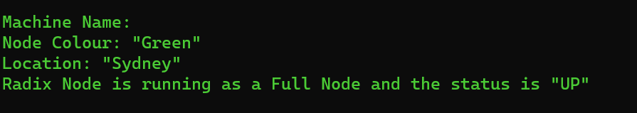

# Message of the Day (MOTD)
This shell script can be installed to augment your existing shell login with information about your radix node

## Prerequisites
This script is currently only available for nodes running on Ubuntu/Debian

## Install
Copy the file ```script/70-radix-node``` to the following directory  ```/etc/update-motd.d``` on your linux machine.  You can use ```sudo wget -O 70-radix-node https://raw.githubusercontent.com/RadixLogicalMoon/NodeUtilityScripts/main/motd-script/script/70-radix-node```

Run the following commands to set the permissions correctly
```
sudo chmod 755 70-radix-node
sudo chmod +x 70-radix-node
```

### Create a config file
Create a config file and store it in directory ```/etc/radixdlt/node``` with name ```nodeDetails.json```.

- ```apiPort``` should be the post used by your localhost API calls.  If you're using NGINX this may have been changed from the default 3333 to 3334.  
- ```colour``` deliniates color based on the blue green methodology
- ```location``` the physical location of the node
- ```validatorAddressId``` the id of validator address (used to identify if the node is running as a validator or full node)


```
{
    "apiPort":"3333",    
    "colour":"Orange",
    "location":"London",
    "validatorAddressId":"rv1qd7533ya9vjgdp83crtlsfvamqxtzdptamlqcmqmc2vd3hwnsezxk7hta3g"
}
```

## Executing It
Now logout and log back in and you should see the changes



## Run without logging in
You can re-run without logging back in by running the command ```sudo run-parts /etc/update-motd.d/``` (This just executes all the scripts in the directory ```/etc/update-motd.d```).  If the changes have not worked, make sure you have set the permissions correctly
